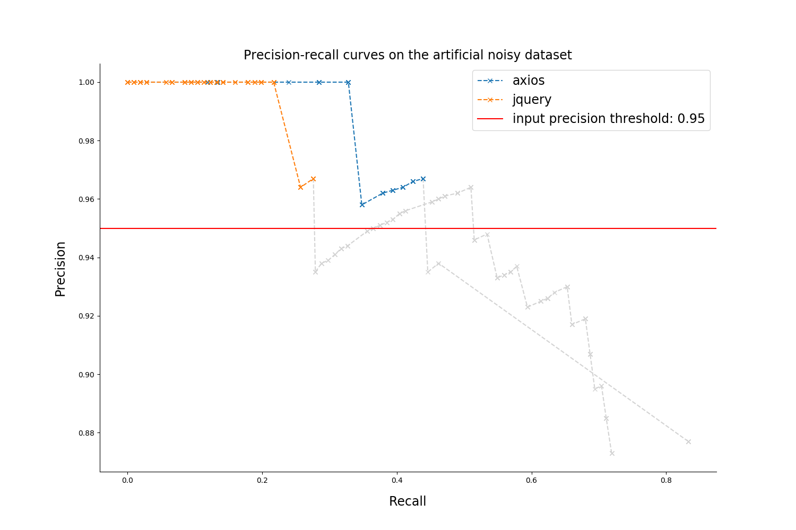

# Quality report on the artificial noisy dataset

### Rules filtering thresholds

* `Confidence: 0.0  `
* `Support: 80`

### Metrics table

| repository |  number of mistakes  | recall at threshold precision | precision at max recall |    empirical confidence threshold     |    max recall     |        Number of rules (filtered / overall)          |
|:----------:|:--------------------:|:-----------------------------:|:-----------------------:|:-------------------------------------:|:-----------------:|:----------------------------------------------------:|
|  axios  | 67 |  0.439 |  0.877 | 0.9194 | 0.833 | `187 / 591` |
|  jquery  | 106 |  0.276 |  0.873 | 0.9476 | 0.719 | `418 / 1107` |

### Precision-recall curves

